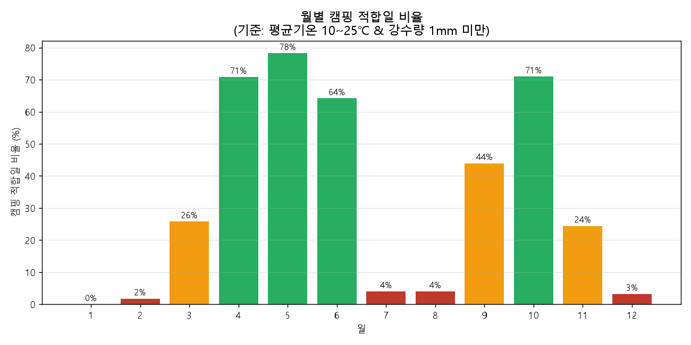

# 세종 합강캠핑장 날씨 트렌드 분석

세종 합강캠핑장을 자주 찾는 캠핑족 입장에서 던진 질문 하나에서 시작한 프로젝트입니다.

> "언제 가야 날씨가 가장 좋을까?"

감이나 경험이 아니라, 실제 기상 데이터를 가지고 세종 지역의 계절별 날씨 패턴을 분석해서 캠핑하기 가장 좋은 시기를 데이터 기반으로 찾아봤습니다.

## 프로젝트 소개

- **분석 대상**: 세종 지역(기상청 ASOS 지점번호 239) 일별 기온·강수량
- **분석 기간**: 2023-01-01 ~ 2026-09-01 (약 3.7년, 1,340개 데이터 포인트)
- **핵심 목표**: "캠핑 적합일"이라는 지표를 직접 설계해서, 어느 달에 캠핑 가기 좋은지를 숫자로 확인

전체 분석 과정과 다섯 가지 인사이트, 결론/한계점은 [REPORT.md](REPORT.md)에 자세히 정리되어 있습니다. 이 README는 프로젝트를 처음 보시는 분들을 위한 요약과 실행 가이드입니다.

## 분석 질문

1. 세종 지역 기온은 연중 어떤 추세와 계절 패턴을 보이는가?
2. 월별로 "캠핑하기 좋은 날"의 비율은 얼마나 차이가 나는가?
3. 일교차가 큰 시기는 언제이며, 캠핑 장비 준비와 어떻게 연결되는가?
4. 강수량은 특정 계절에 집중되는가?
5. 2023~2026년 사이 뚜렷한 온난화·추세 변화가 관측되는가?

## 핵심 결과 요약

- 4~5월, 10월이 캠핑 적합일 비율 70%대로 가장 좋은 시기 (5월이 78%로 최고)
- 1월·7~8월·12월은 5% 미만으로 캠핑에 부적합 (혹한 또는 폭염+장마)
- 여름철(6~8월)에 연간 강수량의 약 56%가 집중되어 있어, 여름 캠핑 시 방수 대비가 중요



## 구현 방법

### 1단계 — 데이터 수집
기상청 기상자료개방포털(data.kma.go.kr)에서 세종 지점의 일별 기온·강수량 데이터를 각각 CSV로 다운로드했습니다. 비회원은 다운로드 가능한 행 수가 30건으로 제한되어 있어서, 무료 회원가입 후 전체 기간 데이터를 받았습니다.

### 2단계 — 데이터 정제 (`raw_data/` → `data/`)
- 기상청 CSV는 CP949(한글 Windows 인코딩)로 되어 있어 인코딩을 맞춰 읽었습니다.
- 기온 원본 파일은 헤더에 콤마 하나가 빠져 있어 컬럼이 밀리는 문제가 있었는데, 컬럼명을 직접 지정해서 해결했습니다.
- 기온·강수량 두 파일을 `일시`(날짜) 기준으로 병합했습니다.
- 기온 결측치 2건은 앞뒤 날짜로 선형보간(interpolation), 강수량 결측치는 "비 안 옴(0mm)"으로 처리했습니다.

### 3단계 — 시계열 분석
- 이동평균(7일/30일)으로 일별 노이즈를 줄여 계절 추세를 뚜렷하게 확인
- 월별 집계(연도 구분 없이)로 계절성(seasonality) 파악
- 캠핑 적합일 지표를 직접 설계: 평균기온 10~25℃ & 강수량 1mm 미만인 날을 "캠핑 적합일"로 정의하고 월별 비율 계산

### 4단계 — 시각화
matplotlib으로 그래프 3개를 그렸습니다 (일별 기온 추이, 월별 기온·강수량 패턴, 월별 캠핑 적합일 비율). Windows에서 한글이 깨지는 문제는 `Malgun Gothic` 폰트를 지정해서 해결했습니다.

## 진행하며 겪었던 문제들

작업하면서 실제로 부딪혔던 문제와 해결 과정을 남겨둡니다.

| 문제 | 원인 | 해결 |
|---|---|---|
| CSV가 다운로드 안 됨(30건 제한) | 기상청 비회원 다운로드 제한 | 무료 회원가입 후 재다운로드 |
| 기온 데이터 컬럼이 밀림 | 원본 헤더에 콤마 누락 | 컬럼명을 코드에서 직접 지정 |
| 그래프 한글이 네모(□)로 깨짐 | OS별 한글 폰트 미지정 | `Malgun Gothic`(Windows) / `AppleGothic`(Mac) 지정 |
| `git push` 시 403 에러 | Windows에 저장된 예전 GitHub 계정 정보 | 자격 증명 관리자에서 기존 로그인 정보 삭제 후 재인증 |

## 폴더 구조

```
.
├── raw_data/
│   ├── raw_temperature.csv       # 기상청 원본 기온 데이터 (CP949 인코딩)
│   └── raw_precipitation.csv     # 기상청 원본 강수량 데이터 (CP949 인코딩)
├── data/
│   └── sejong_weather_clean.csv  # 정제·병합된 최종 데이터
├── images/
│   ├── 01_temp_trend.png         # 일별 기온 추이 + 30일 이동평균
│   ├── 02_monthly_pattern.png    # 월별 기온·강수량 패턴 (계절성)
│   └── 03_camping_suitability.png # 월별 캠핑 적합일 비율
├── analysis.py                   # 분석 코드 (# %% 셀 방식, VS Code용)
├── analysis.ipynb                # 분석 코드 (Jupyter 노트북 버전, 동일한 내용)
├── REPORT.md                     # 전체 분석 리포트 (질문·인사이트·결론)
├── requirements.txt
└── README.md                     # 이 파일
```

## 실행 방법

### 준비물
```bash
pip install -r requirements.txt jupyter
```

### 방법 A — VS Code에서 analysis.py 실행 (추천)
1. VS Code에 Jupyter 확장 프로그램 설치
2. `analysis.py` 열기
3. 각 `# %%` 구간 위의 "셀 실행"을 위에서부터 순서대로 클릭
4. 오른쪽 Interactive 창에 결과와 그래프가 바로 나타남

Windows에서 그래프 한글이 깨지면, 코드 상단의 폰트 설정 부분을 `plt.rcParams['font.family'] = 'Malgun Gothic'`으로 바꿔주세요.

### 방법 B — Jupyter 노트북으로 실행
```bash
jupyter notebook analysis.ipynb
```
처음부터 순서대로 셀을 실행하면 데이터 정제 → 시계열 분석 → 시각화 → 데이터 저장까지 그대로 재현됩니다.

## 데이터 출처

- 기상청 기상자료개방포털(https://data.kma.go.kr) — 종관기상관측(ASOS) 세종 지점(239) 일자료
- 공공데이터로, 출처를 명시하면 자유롭게 활용 가능합니다.
