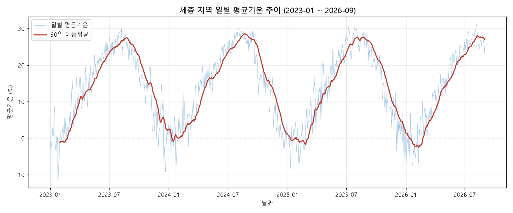
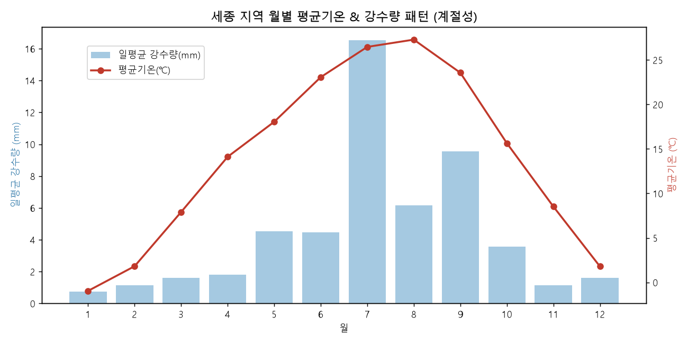

# 세종 합강캠핑장 지역 날씨 트렌드 분석 리포트

## 1. 분석 주제 및 선정 이유

세종 합강캠핑장을 자주 방문하는 캠핑족 입장에서, "언제 가야 날씨가 가장 좋을까?"는 실제 계획에 직결되는 질문이다. 감으로 판단하지 않고, 세종 지역의 최근 기온·강수량 데이터를 직접 분석해서 계절별 패턴과 캠핑 최적기를 데이터로 확인해보고자 이 주제를 선정했다.

## 2. 분석 질문

1. 세종 지역의 기온은 연중 어떤 추세와 계절 패턴을 보이는가?
2. 월별로 "캠핑하기 좋은 날"의 비율은 얼마나 차이가 나는가?
3. 일교차가 큰 시기는 언제이며, 캠핑 장비 준비와 어떻게 연결되는가?
4. 강수량은 특정 계절에 집중되는가, 아니면 고르게 분포하는가?
5. (추가) 2023~2026년 사이 뚜렷한 온난화·추세 변화가 관측되는가?

## 3. 데이터 설명

- **출처**: 기상청 기상자료개방포털(data.kma.go.kr) — 종관기상관측(ASOS) 일자료
- **지점**: 세종 (지점번호 239)
- **기간**: 2023-01-01 ~ 2026-09-01 (일별)
- **데이터 포인트**: 1,340개 (요구 기준 100개 이상 충족)
- **수집 항목**: 평균/최고/최저기온, 일교차, 강수량
- **파일 구성**: 기온과 강수량을 별도 파일로 다운로드한 뒤, `일시` 컬럼을 기준으로 병합

## 4. 데이터 정제

- **컬럼 파싱 오류**: 기온 원본 파일의 헤더에서 콤마 하나가 누락되어(`최저기온시각일교차`) 컬럼이 밀리는 문제가 있어, 컬럼명을 직접 지정해 재파싱했다.
- **인코딩**: 기상청 CSV는 CP949(EUC-KR)로 인코딩되어 있어 `encoding='cp949'`로 지정해 읽었다.
- **결측치**:
  - 기온: 2023-02-01~02 이틀치가 결측 → 앞뒤 날짜 기준 선형보간(interpolation)으로 채움
  - 강수량: 비가 오지 않은 날은 공란으로 기록되는 기상청 관례에 따라 결측치를 0mm로 처리
- **이상치 점검**: 강수량 최댓값(283.7mm, 2023-07-15)을 확인했으나, 여름철 집중호우 시기와 일치하는 실측값으로 판단해 제거하지 않고 그대로 사용했다.

## 5. 시계열 분석 기법

1. **이동평균(Moving Average)**: 7일·30일 이동평균을 계산해 일별 노이즈를 줄이고 계절 추세를 뚜렷하게 확인
2. **월별 집계(연도 무관)**: 연도 구분 없이 월(1~12월) 단위로 평균기온·평균강수량을 집계해 계절성(seasonality)을 분석
3. **캠핑 적합일 지표 설계**: 평균기온 10~25℃ & 강수량 1mm 미만인 날을 "캠핑 적합일"로 정의하고 월별 비율 계산
4. **연도별 비교**: 2023~2026년(1~9월 기준) 평균기온을 비교해 장기 추세 존재 여부 확인

## 6. 시각화

**그래프 1. 일별 평균기온 추이 + 30일 이동평균**

사계절이 뚜렷한 사인파 형태로 반복되며, 여름철 정점(27~29℃)과 겨울철 저점(약 -1~0℃)이 매년 규칙적으로 나타난다.

**그래프 2. 월별 평균기온 & 강수량 패턴**

기온은 7~8월에 정점을 찍고, 강수량도 같은 시기에 급증하는 것을 볼 수 있다 — 무더위와 장마가 겹치는 시기임을 보여준다.

**그래프 3. 월별 캠핑 적합일 비율**

4월(71%), 5월(78%), 10월(71%)이 캠핑에 가장 유리한 반면, 1월(0%)·7월(4%)·8월(4%)·12월(3%)은 매우 불리하다.

## 7. 인사이트

**인사이트 1 — 뚜렷한 계절성**
- 관찰: 30일 이동평균 기준 여름철 최고 27~29℃, 겨울철 최저 -1~0℃로, 연교차가 약 28~30℃에 달한다.
- 해석: 세종은 내륙 지역 특성상 사계절 기온차가 크며, 캠핑 계획 시 계절별 장비(하절기 냉방/방충, 동절기 방한)를 확실히 구분해서 준비해야 한다.

**인사이트 2 — 봄·가을이 캠핑 최적기**
- 관찰: 캠핑 적합일 비율이 4월 71%, 5월 78%, 10월 71%로 봄·가을에 집중된 반면, 1월·7월·8월·12월은 5% 이하다.
- 해석: "봄가을 캠핑 성수기"라는 통념이 실제 데이터로도 뒷받침된다. 합강캠핑장 방문을 계획한다면 4~5월, 10월이 가장 안정적인 선택지다.

**인사이트 3 — 봄철 일교차 주의**
- 관찰: 월별 평균 일교차가 3~4월에 12.4~12.9℃로 연중 최고인 반면, 7월은 7.5℃로 최저다.
- 해석: 캠핑 적합일 비율이 높은 4~5월이라도 낮과 밤의 온도차가 크므로, 보온 등급이 넉넉한 침낭이나 겹쳐 입을 옷을 함께 챙기는 것이 안전하다.

**인사이트 4 — 여름철 강수 집중**
- 관찰: 6~8월 강수량이 연간 총 강수량의 55.9%를 차지하며, 강수량 상위 5일 중 4일이 7~9월에 몰려 있다(최대 2023-07-15, 283.7mm).
- 해석: 여름 캠핑을 고려한다면 방수 타프, 배수가 잘 되는 사이트 선택 등 우천 대비가 특히 중요하다. 강수 집중일은 대개 짧고 강하게 오는 집중호우 패턴에 가깝다.

**인사이트 5 — 짧은 기간 내 뚜렷한 온난화 추세는 미관측**
- 관찰: 연도별(1~9월 기준) 평균기온은 2023년 15.67℃, 2024년 16.44℃, 2025년 15.38℃, 2026년 14.73℃로 특정 방향 없이 등락했다.
- 해석: 3.7년이라는 관측 기간은 장기 기후 추세를 판단하기에 짧으며, 연도 간 편차보다 계절 내 변동성이 훨씬 지배적인 패턴임을 알 수 있다.

## 8. 결론 및 한계점

**결론**: 세종 지역은 뚜렷한 사계절 패턴을 보이며, 캠핑에는 4~5월과 10월이 가장 적합하다(적합일 비율 70%대). 여름은 폭염과 집중호우가 겹쳐, 겨울은 혹한으로 인해 캠핑 적합일이 5% 미만으로 크게 줄어든다. 봄철에는 일교차가 크므로 보온 장비를, 여름철에는 우천 대비를 별도로 챙기는 것이 좋다.

**한계점**:
- 세종 지점(239) 관측소 데이터를 사용했으며, 합강캠핑장의 실제 강변 국지 기후(습도, 바람, 야간 기온 등)와는 다소 차이가 있을 수 있다.
- "캠핑 적합일" 기준(기온 10~25℃ & 강수 1mm 미만)은 분석을 위해 임의로 설정한 것으로, 체감온도·습도·바람 등은 반영하지 않았다. 개인 성향에 따라 적합 기준은 달라질 수 있다.
- 관측 기간이 3.7년으로 짧아 이상기후나 장기 기후변화 추세를 판단하기엔 한계가 있다.
- 2026년은 9월 초까지만 데이터가 있어, 연도별 비교 시 다른 해와 완전히 동일한 조건은 아니다(그래서 1~9월 기준으로만 비교했다).

## 9. AI 사용 로그

- **사용 작업**: CSV 인코딩/헤더 파싱 오류 해결 코드 작성, 결측치 처리(선형보간) 및 데이터 병합, 이동평균·월별 집계·캠핑 적합일 지표 설계 및 계산, 시각화(matplotlib) 코드 작성, 리포트 구조화 및 문장 다듬기
- **사용 이유**: 반복적인 데이터 클리닝/파싱 작업의 시간 절감, 캠핑 적합일 지표 등 분석 아이디어 탐색 및 구현 속도 향상
- **검증 방법**: 각 처리 단계마다 `head()`/`tail()`/`describe()`/`isna().sum()`으로 직접 수치를 확인했고, 결측치 처리 전후 값을 비교해 보간 결과가 합리적인지 검토했다. 최종 인사이트에 사용된 통계치(연도별 평균, 월별 비율 등)는 원본 데이터에서 별도로 재계산해 리포트 서술과 대조 확인했다.

## 10. 재현 방법

```bash
pip install -r requirements.txt
jupyter notebook analysis.ipynb   # 처음부터 끝까지 순서대로 실행
```

원본 데이터는 `raw_data/` 폴더에, 정제된 최종 데이터는 `data/sejong_weather_clean.csv`에 저장되어 있다.
